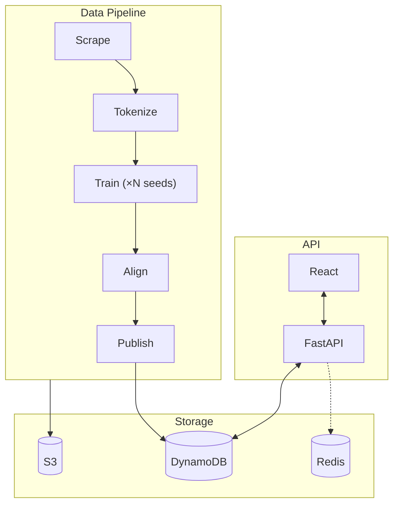

# Embedding Analytics — Backend

Embedding similarity with confidence intervals.

Instead of:
```
similarity("market", "price") = 0.35
```
You get:
```
similarity = 0.35, 95% CI [0.31, 0.40]
```

Trains **ensembles of Word2Vec models** on Project Gutenberg texts, aligns them via **Generalized Procrustes Analysis**, and serves similarity with confidence intervals through a FastAPI endpoint. Serverless, containerized, zero idle cost.

**→ [Live Demo](https://www.embedding-analytics.com)** &nbsp;|&nbsp; **→ [Frontend Repo](https://github.com/areebms/embedding-analytics-frontend)**


---

## Architecture



Six containerized Lambda functions on Python 3.13. S3 stores intermediate artifacts during training. DynamoDB stores final term-level vectors (float16) and metadata for fast API reads. Redis caching is optional.

**→ [Detailed pipeline documentation](docs/pipeline.md)** — per-stage inputs, outputs, configs, and design decisions.

**→ [Alignment math](docs/alignment.md)** — Generalized Procrustes Analysis, convergence, per-term metrics.

---

## API

**`GET /books`** — all corpora with completed pipelines.
```json
[
  {
    "id": 3300,
    "label": "Smith (1776)",
    "author": "Smith, Adam",
    "title": "An Inquiry into...",
    "published_year": 1776
  }
]
```

**`POST /similarity/{book_id}`** — similarity with 95% confidence intervals via t-distribution. Supports dual-term queries (vectors averaged and re-normalized).
```json
// Request
{ "primary_term": "market", "secondary_term": "price" }

// Response
[
  {
    "term": "labour",
    "pos": ["N", "V"],
    "count": 1337,
    "similarity": 0.354,
    "similarity_ci": [0.312, 0.396]
  }
]
```

Tight CI = ensemble agreed. Wide CI = treat with skepticism.

---

## Quick start

```bash
git clone https://github.com/areebms/embedding-analytics.git
cd embedding-analytics
cp .env.example .env   # fill in AWS creds, S3 bucket, DynamoDB tables
docker-compose build
```

Run the pipeline:
```bash
docker-compose run lambda-scrape python main.py --platform-name gutenberg --platform-id 3300
docker-compose run lambda-tokenize python main.py --platform-name gutenberg --platform-id 3300
docker-compose run lambda-train-kvector python main.py --platform-name gutenberg --platform-id 3300 --seed 1
docker-compose run lambda-train-kvector python main.py --platform-name gutenberg --platform-id 3300 --seed 2
docker-compose run lambda-align-kvectors python main.py --platform-name gutenberg --platform-id 3300
docker-compose run lambda-publish python main.py --platform-name gutenberg --platform-id 3300
```

More seeds = tighter confidence intervals. Every stage is idempotent.

Start the API:
```bash
docker-compose up lambda-api    # → http://localhost:8000
```

Deploy:
```bash
cd infra
./push_to_ecr.sh scrape tokenize train-kvector align-kvectors publish api
```

**→ [Full setup guide](docs/pipeline.md#getting-started)** — env vars, prerequisites, Apple Silicon notes, Redis config.

---

## Repo layout

```
embedding-analytics/
├── functions/
│   ├── scrape/             # Gutenberg scraper
│   ├── tokenize/           # spaCy + NLTK lemmatization
│   ├── train-kvector/      # Word2Vec worker (one model per seed)
│   ├── align-kvectors/     # Generalized Procrustes alignment
│   ├── publish/            # Flatten S3 artifacts → DynamoDB Term Table
│   └── api/                # FastAPI + Mangum (2 endpoints)
├── shared/
│   ├── aws.py              # S3, DynamoDB (Pipeline + Term tables), helpers
│   └── commons.py          # CLI arg parsing
├── infra/
│   ├── push_to_ecr.sh      # Build + deploy script
│   └── services.yaml       # Lambda config (memory, timeouts)
├── docker-compose.yml
└── .env.example
```

---

## What's next

- [ ] Step Functions orchestration for multi-corpus pipelines
- [ ] Expose the training pipeline as callable endpoints if traffic warrants it

---

## License

Apache-2.0 — see [LICENSE](./LICENSE)

---

**Areeb Siddiqi** — [LinkedIn](https://www.linkedin.com/in/areeb-siddiqi/) · [GitHub](https://github.com/areebms)
