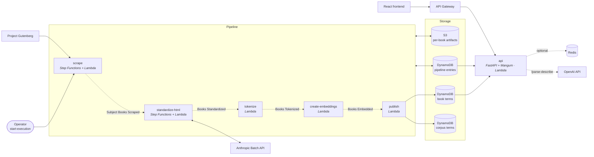

# Embedding Analytics

**Live demo:** https://www.embedding-analytics.com  
**Frontend repo:** https://github.com/areebms/embedding-analytics-frontend

Two documents can use the same words to mean very different things. Treatises, legal opinions and technical specifications routinely have to be read several times before those shifts in meaning surface at all, and a close reading is the only conventional way to find them.

Embedding Analytics lets you query and quantify changes in definitions across a collection of documents. For each document, the tool uses PPMI + SVD to create semantic embeddings. Your query is used to find the most similar terms within each document. To compare these similarities across documents, we compute the query's mean similarity to its 75 closest terms in each document, then rescale the similarities so the mean cosine similarity is the same across documents. The adjustment is adapted from cross-domain similarity local scaling (Conneau et al., 2018). Adjusted similarities from different queries cannot be compared.

Since there can be too many shared terms across a collection of documents, Embedding Analytics identifies relevant terms that can be compared across the collection. A term is relevant if its adjusted similarity is above the baseline in at least 20% of the documents that carry the query. There are two types of relevant terms identified.

- **Consistent terms** have the highest mean similarity to the query. They are closely tied to it across the collection: the core of its definition, the part the authors hold in common.
- **Contested terms** have the highest standard deviation. They are close to the query in some documents and not in others. They are where the definition moves.

## Sample results

Querying `value` across 24 books, where the average baseline is 0.321, returns the following.

*utility*, the basis of value in the marginalist theory that displaced the classical labour theory, leads the contested list.


*commodity* is the most closely associated term with value within the collection.


The highlighted line is *utility*. It peaks in Bastiat's *Harmonies* (0.68) and is high in Clark (0.47), who both tie value to utility. It falls below zero in Steuart, Smith and Fetter; Fetter uses the word for public utilities such as gas and railways.

---

## Architecture


```mermaid
flowchart LR
    OP([Operator<br/>start-execution]) --> SCR
    GUT[Project Gutenberg] --> SCR

    subgraph Pipeline
        SCR["scrape<br/><i>Step Functions + Lambda</i>"]
        STD["standardize-html<br/><i>Step Functions + Lambda</i>"]
        TOK["tokenize<br/><i>Lambda</i>"]
        EMB["create-embeddings<br/><i>Lambda</i>"]
        PUB["publish<br/><i>Lambda</i>"]
        SCR -. Subject Books Scraped .-> STD
        STD -. Books Standardized .-> TOK
        TOK -. Books Tokenized .-> EMB
        EMB -. Books Embedded .-> PUB
    end

    STD <--> ANT[Anthropic Batch API]

    subgraph Storage
        S3[(S3<br/>per-book artifacts)]
        PE[(DynamoDB<br/>pipeline entries)]
        BT[(DynamoDB<br/>book terms)]
        CT[(DynamoDB<br/>corpus terms)]
    end

    Pipeline <--> S3
    Pipeline <--> PE
    PUB --> BT
    PUB --> CT

    BT --> API
    PE --> API
    UI[React frontend] --> GW[API Gateway] --> API["api<br/><i>FastAPI + Mangum · Lambda</i>"]
    API -. optional .-> RED[(Redis)]
    API -. /parse-describe .-> OAI[OpenAI API]
```

| Area | Tools |
|---|---|
| API | Python 3.13, FastAPI, Mangum, Pydantic |
| AI/ML | NumPy, SciPy (`scipy.sparse`, `svds`), OpenAI API, Anthropic Batch API |
| Cloud | AWS Lambda, API Gateway, Step Functions, EventBridge, S3, DynamoDB, ECR |
| NLP/Data | spaCy, NLTK, WordNet, BeautifulSoup |
| Testing | pytest, coverage gating, Docker test stages |
| Infrastructure | AWS CDK (Python), Docker, Docker Compose |

Six independent containerized Lambda functions — scraping, heading classification, tokenization, embedding, publishing, and API serving. S3 holds intermediate artifacts; the publish stage flattens one vector per term into DynamoDB for sub-second API reads. Fully serverless, no always-on infrastructure. Per-service pytest suites run inside a dedicated Docker test stage before any image is pushed, and every suite enforces an 85% coverage floor.

Each stage but `publish` announces on the EventBridge default bus when it finishes — the two state machines from their definitions, `tokenize` and `create-embeddings` from inside the function — and a rule per consumer turns each announcement into the next invocation, so a stage can be redeployed, re-run or replaced without any other stage naming it. `standardize-html` is the one that leaves the account: it classifies every heading in a book through the Anthropic Batch API, submitting once, then called back by its state machine every five minutes to collect until the batch settles, because a batch is asynchronous. [Pipeline](docs/pipeline.md) has the map.

---

## Documentation

| Document | What's in it |
|---|---|
| [Pipeline](docs/pipeline.md) | How a book becomes queryable, in six steps, with a link to each step's own docs |
| [Infra](infra/README.md) | Orchestration, recovery, and deployment |
| [API](functions/api/README.md) | The request path, what the score measures, and the API contract |
| [Shared code](shared/README.md) | The three DynamoDB tables, the book id, and the S3 key derivation every service agrees on |
| [Method notes](docs/method-notes.md) | Scope of the claims, why there are no confidence intervals, and what the between-book variation is |
| [Changelog](CHANGELOG.md) | Release history |

---

## Running locally

```bash
git clone https://github.com/areebms/embedding-analytics.git
cd embedding-analytics
cp .env.example .env
docker compose build
docker compose up lambda-api    # --> http://localhost:8000
```

`.env` needs real values first. The API reads the DynamoDB tables that `publish` writes, so a clone with an empty `.env` will build and start but answer every query against an empty vocabulary. There is no bundled fixture corpus yet — running the system on your own texts means running the pipeline first. To see it working without any of that, use the [live demo](https://www.embedding-analytics.com).

Every suite runs inside its own service's image, against the production dependency set:

```bash
docker build -f functions/api/Dockerfile --target test -t api-test . && docker run --rm api-test
```

Each stage's README has that line for the stage it documents. `python3.13 infra/deploy.py` runs the infra suite, then each service's, before it deploys.

Processing a book is covered in [Pipeline](docs/pipeline.md), and deployment in [infra](infra/README.md#deploying).

---

## What's next

- [ ] Add a concordance.
- [ ] Allow texts to be excluded from analysis.

---

## License

Apache-2.0

---

**Areeb Siddiqi** · [LinkedIn](https://www.linkedin.com/in/areeb-siddiqi/)
