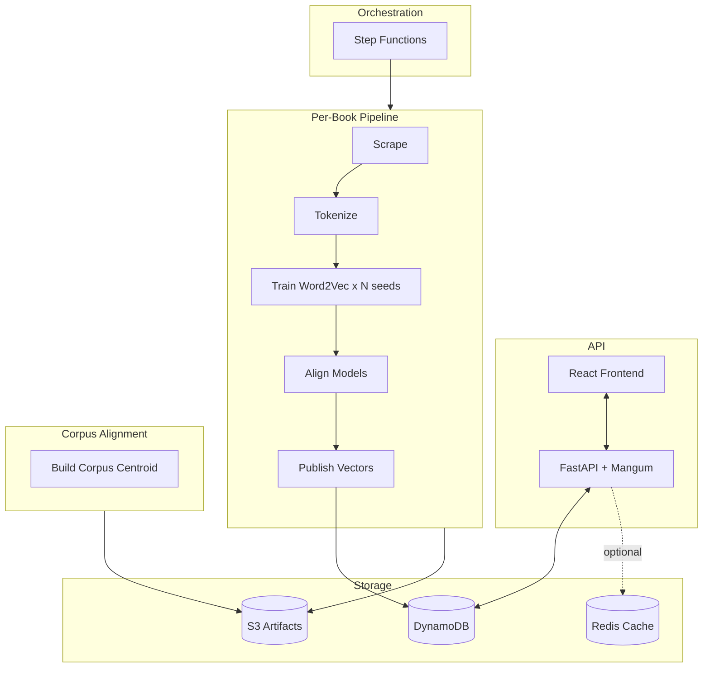

# Embedding Analytics — Backend

Six containerized Python microservices on AWS Lambda, orchestrated by Step Functions, serving a FastAPI API backed by DynamoDB and Redis.

The system trains Word2Vec model ensembles, aligns them via Generalized Procrustes Analysis, and returns similarity results with 95% confidence intervals through recursive expression-tree evaluation and LLM-assisted natural-language parsing.

**Live demo:** https://www.embedding-analytics.com
**Frontend repo:** https://github.com/areebms/embedding-analytics-frontend

---

## Engineering highlights

- **Microservices pipeline:** Six independent, containerized Lambda stages for scraping, tokenization, model training, vector alignment, publishing, and API serving
- **Fan-out orchestration:** Step Functions Map state trains N seeded models in parallel, converging into a single alignment stage
- **Denormalized serving layer:** S3 holds intermediate artifacts during training; a publish stage flattens everything into DynamoDB for sub-second API reads
- **LLM integration with guardrails:** OpenAI-powered natural-language parsing bounded by recursive descent validation, tiered vocabulary resolution, and structured error recovery
- **Ensemble confidence scoring:** Queries are evaluated across every aligned model independently, producing 95% confidence intervals instead of single-point similarity scores
- **Zero idle cost:** Fully serverless, containerized, no always-on infrastructure

The domain is classical political economy, but the architecture maps directly to production AI infrastructure: data ingestion, model generation, vector serving, LLM parsing, validation, caching, and low-cost cloud deployment.

---

## What the product does

A standard Word2Vec interface returns nearest neighbours for a single term. This system supports compositional queries with vector arithmetic.

A single term like `capital` can return results from multiple meanings. Adding a second term narrows the context:

```text
capital + profit
```

This pulls "capital" toward its economic sense and away from the geographical one.

Subtraction creates contrast directions. The query `labour + (productive - unproductive)` starts with labour and tilts it toward the productive side of the productive/unproductive distinction:

```text
labour + (productive - unproductive)
```

The backend evaluates that expression against each aligned model in the ensemble and returns ranked terms with 95% confidence intervals. Results reflect contextual proximity, not dictionary meaning: two terms score highly because the authors discuss them in similar contexts, not because they are synonyms. Tight intervals indicate the relationship was consistent across training runs; wide intervals flag instability.

Users can also type plain English:

```text
productive vs unproductive labour
```

The backend converts that into a validated expression tree, resolves every term against the corpus vocabulary, and returns the structured expression for the frontend to render and edit.

More detail: [`docs/guide.md`](docs/guide.md)

---

## Architecture


```mermaid
graph TD
    subgraph Orchestration
        SF[Step Functions]
    end

    subgraph API
        direction LR
        UI[React Frontend] <--> FAPI[FastAPI + Mangum]
    end

    subgraph Storage
        direction LR
        DDB[(DynamoDB)]
        RED[(Redis Cache)]
        S3[(S3 Artifacts)]
    end

    subgraph Pipeline [Per-Book Pipeline]
        direction LR
        SCR[Scrape] --> TOK[Tokenize] --> TRN["Train Word2Vec x N seeds"] --> ALN[Align Models] --> PUB[Publish Vectors]
    end

    subgraph Corpus [Corpus Alignment]
        direction LR
        BCC[Build Corpus Centroid]
    end

    SF --> Pipeline
    Pipeline --> S3
    PUB --> DDB
    FAPI <--> DDB
    FAPI -. optional .-> RED
    Corpus --> S3
```

---

## Tech stack

| Area | Tools |
|---|---|
| API | Python 3.13, FastAPI, Mangum, Pydantic |
| AI/ML | Gensim Word2Vec, NumPy, SciPy, OpenAI API |
| Cloud | AWS Lambda, Step Functions, S3, DynamoDB, ECR |
| Caching | Redis, fastapi-cache |
| NLP/Data | spaCy, NLTK, WordNet, BeautifulSoup |
| Infrastructure | Docker, Docker Compose, Bash |

---

## Pipeline

Six containerized Lambda services, each a single stage with its own memory and timeout configuration:

| Stage | What it does | Output |
|---|---|---|
| `scrape` | Pulls source text and metadata from Project Gutenberg | HTML, clean text, metadata in S3 |
| `tokenize` | Segments, lemmatizes, normalizes spelling, tags POS | Token CSVs in S3 |
| `train-kvector` | Trains one seeded Word2Vec model | `.model` artifact in S3 |
| `align-kvectors` | Aligns seed models into a shared vector space via GPA | Rotated models + centroid in S3 |
| `publish` | Flattens vectors and metadata into a denormalized serving layer | Term rows in DynamoDB |
| `api` | Serves books, terms, similarity, and NL parse endpoints | JSON responses via Lambda Function URL |

Step Function flow:

```text
scrape --> tokenize --> train-kvector Map(N seeds) --> align-kvectors --> publish
```

Every stage is idempotent: failed or repeated runs skip already-completed work and resume safely.

A separate corpus-alignment job builds a cross-book frame from 2+ completed books, enabling cross-author comparison.

More detail: [`docs/pipeline.md`](docs/pipeline.md)

---

## API endpoints

### `GET /books`

Returns every corpus that has completed the full pipeline.

```json
[
  {
    "id": 3300,
    "label": "Smith (1776)",
    "author": "Smith, Adam",
    "title": "An Inquiry into...",
    "published_year": 1776
  }
]
```

### `GET /terms`

Returns the cross-book vocabulary. Terms must appear in at least two books. Adverb-only terms are excluded.

```json
[
  {
    "term": "labour",
    "books": ["gutenberg-3300", "gutenberg-846"]
  }
]
```

### `POST /similarity/{book_id}`

Accepts a recursive expression tree (Pydantic-validated) and returns ranked similarity results with confidence intervals.

```json
{
  "tree": {
    "op": "+",
    "args": [
      { "term": "labour" },
      {
        "op": "-",
        "args": [
          { "term": "productive" },
          { "term": "unproductive" }
        ]
      }
    ]
  }
}
```

Response:

```json
[
  {
    "term": "capital",
    "pos": ["N"],
    "count": 942,
    "similarity": 0.354,
    "similarity_ci": [0.312, 0.396]
  }
]
```

### `POST /parse-describe`

Converts plain English into a validated vector expression. Uses an LLM for expression generation, then validates via recursive descent parsing and resolves every term against the DynamoDB vocabulary through a three-tier fallback (exact match, fuzzy match, LLM-assisted resolution). Returns 422 with candidate suggestions when a term cannot be resolved.

Request:

```json
{ "message": "productive vs unproductive labour" }
```

Response:

```json
{
  "expression": "labour + (productive - unproductive)",
  "terms": ["labour", "productive", "unproductive"],
  "substitutions": []
}
```

More detail: [`docs/describe.md`](docs/describe.md)

---

## Alignment and reliability

A single Word2Vec model trained on a small corpus is unreliable. This backend trains multiple seeded models, aligns them with Generalized Procrustes Analysis, and evaluates every query across the full ensemble to produce 95% confidence intervals.

The alignment pipeline operates at two levels: within-book GPA aligns seed models into a per-book centroid, and cross-book GPA aligns book centroids into a shared corpus frame for cross-author comparison.

The result is a reliability signal that a standard embedding tool does not provide: tight CI means the relationship was stable across training runs, wide CI means treat with skepticism.

More detail: [`docs/alignment.md`](docs/alignment.md)

---

## Running locally

```bash
git clone https://github.com/areebms/embedding-analytics.git
cd embedding-analytics
cp .env.example .env
docker compose build
docker compose up lambda-api    # --> http://localhost:8000
```

Run the per-book pipeline:

```bash
docker compose run lambda-scrape python main.py --platform gutenberg --id 3300
docker compose run lambda-tokenize python main.py --platform gutenberg --id 3300
docker compose run lambda-train-kvector python main.py --platform gutenberg --id 3300 --seed 1
docker compose run lambda-train-kvector python main.py --platform gutenberg --id 3300 --seed 2
docker compose run lambda-align-kvectors python create_book_centroid.py
docker compose run lambda-publish python main.py --platform gutenberg --id 3300
```

Build the cross-book corpus frame:

```bash
docker compose run lambda-align-kvectors python create_corpus_centroid.py
```

---

## Deployment

```bash
./infra/deploy_lambdas.sh scrape tokenize train-kvector align-kvectors publish api
./infra/deploy_step_function.sh
```

Deployment scripts build Docker images for `linux/amd64`, push to ECR, and create or update Lambda services only when the image or configuration has changed.

---

## Repo layout

```text
embedding-analytics/
├── functions/
│   ├── scrape/
│   ├── tokenize/
│   ├── train-kvector/
│   ├── align-kvectors/
│   │   ├── create_book_centroid.py
│   │   ├── create_corpus_centroid.py
│   │   └── procrustes_utils.py
│   ├── publish/
│   └── api/
│       ├── routers.py
│       ├── schemas.py
│       ├── services.py
│       ├── describe_services.py
│       ├── constants.py
│       ├── dependencies.py
│       └── app.py
├── shared/
│   ├── aws.py
│   └── commons.py
├── infra/
│   ├── deploy_lambdas.sh
│   ├── deploy_step_function.sh
│   ├── services.yaml
│   └── step-function.template.json
├── docs/
│   ├── pipeline.md
│   ├── alignment.md
│   ├── describe.md
│   └── guide.md
├── docker-compose.yml
└── .env.example
```

---

## What this demonstrates

- Designing and deploying a multi-stage serverless data pipeline on AWS (Lambda, Step Functions, S3, DynamoDB)
- Python API development with FastAPI, Pydantic schemas, recursive evaluation, and structured error handling
- LLM integration with deterministic validation boundaries and tiered fallback resolution
- Ensemble-based confidence scoring as a production reliability pattern for vector search
- Containerized microservice deployment with per-service resource tuning
- Caching, idempotency, and zero-idle-cost serverless architecture

---

## What's next

- [ ] Pinecone vector database for top-K similarity queries and lower API latency
- [ ] Diachronic similarity chart (semantic drift of a term across books)
- [ ] Expose the training pipeline as callable endpoints if traffic warrants it

---

## License

Apache-2.0

---

**Areeb Siddiqi** -- [LinkedIn](https://www.linkedin.com/in/areeb-siddiqi/) · [GitHub](https://github.com/areebms)
