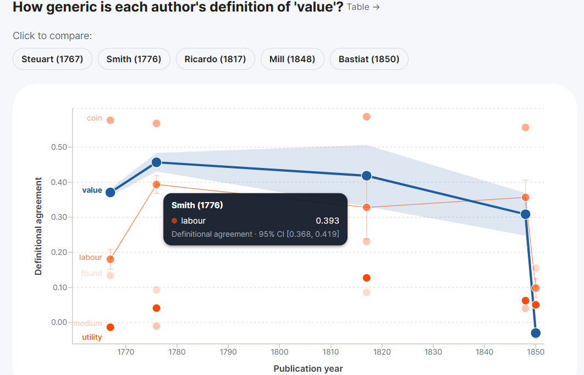
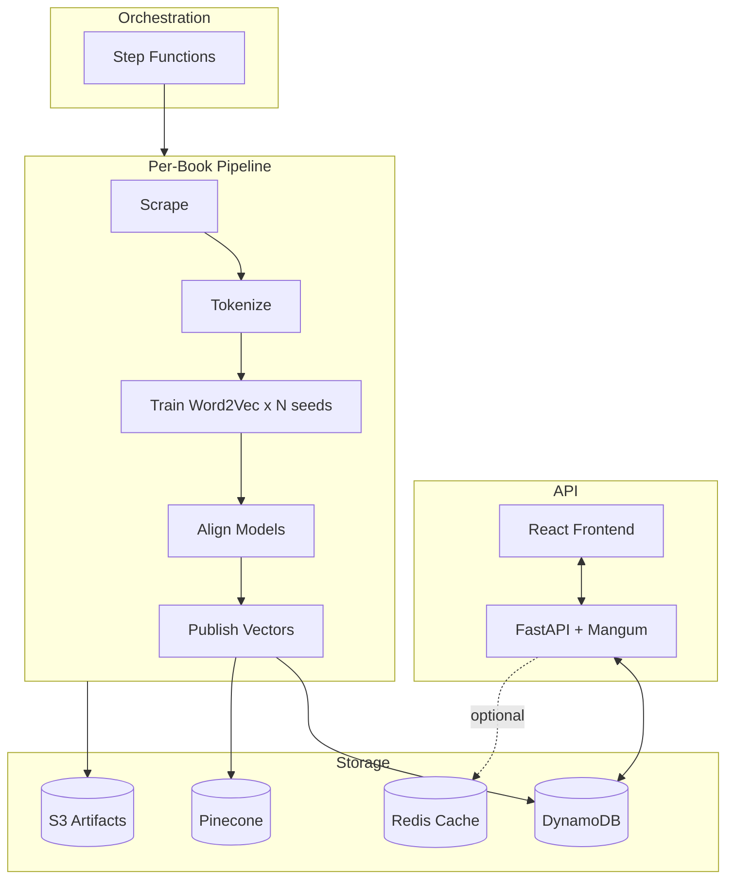

# Embedding Analytics

A shared word does not guarantee a shared concept. Competing treatises, legal opinions, technical standards, and technical specifications may use the same vocabulary but strongly disagree about the definitions. It traditionally requires a very close and careful reading to identify such changes in meaning.

Embedding Analytics provides an alternative method to capture semantic drift. It allows you to search expressions and find comparative terms that every document within the corpus define similarly or inconstently. Stable comparative terms indicate aspects of meaning that the all authors keeps consistent, whereas unstable comparative terms indicate aspects of the meaning that change between authors. Embedding Analytics allows you to query what "labour" meant to Adam Smith versus John Stuart Mill, in vector arithmetic as `labour + (productive - unproductive)` or in plain English.



Behind it: six containerized Lambdas that train a Word2Vec ensemble per book, align them with Generalized Procrustes Analysis, and report every score with a 95% confidence interval rather than a single number. Natural-language queries become validated expression trees through an LLM pipeline with deterministic guardrails.

**Live demo:** https://www.embedding-analytics.com
**Frontend repo:** https://github.com/areebms/embedding-analytics-frontend

---

## What the product does

A standard Word2Vec interface returns the nearest terms for a single term. This system takes compositional queries built with vector arithmetic. Addition narrows context. `capital + profit` pulls "capital" toward its economic sense and away from the geographical one. Subtraction creates a contrast direction. `labour + (productive - unproductive)` finds terms close to productive labour and far from unproductive labour.

A query returns five comparative terms. Each carries a stability score, the mean position the books give it near the query, and an instability score, the variance of those positions. Each book's own score against a term arrives with a 95% confidence interval. The two scores answer different questions. Querying `value` returns the following stable and unstable terms:

| Neighbour | Stability | Instability |
|---|---:|---:|
| silver | +0.128 | 0.009 |
| gold | +0.115 | 0.006 |
| metal | +0.107 | 0.010 |
| commodity | +0.101 | 0.010 |
| money | +0.100 | 0.009 |

Every author places value among the things value is measured in.

| Neighbour | Stability | Instability |
|---|---:|---:|
| utility | −0.072 | 0.058 |
| labour | −0.046 | 0.037 |
| coin | +0.035 | 0.037 |
| medium | −0.099 | 0.037 |
| found | −0.160 | 0.033 |

The two rival theories of value, utility and labour, rank 1 and 2.

---

## Architecture


```mermaid
graph TD
    subgraph Orchestration
        SF[Step Functions]
    end

    subgraph API
        direction LR
        UI[React Frontend] <--> FAPI[FastAPI + Mangum]
    end

    subgraph Storage
        direction LR
        DDB[(DynamoDB)]
        PC[(Pinecone)]
        RED[(Redis Cache)]
        S3[(S3 Artifacts)]
    end

    subgraph Pipeline [Per-Book Pipeline]
        direction LR
        SCR[Scrape] --> TOK[Tokenize] --> TRN["Train Word2Vec x N seeds"] --> ALN[Align Models] --> PUB[Publish Vectors]
    end

    SF --> Pipeline
    Pipeline --> S3
    PUB --> DDB
    PUB --> PC
    FAPI <--> DDB
    FAPI -. optional .-> RED
```

| Area | Tools |
|---|---|
| API | Python 3.13, FastAPI, Mangum, Pydantic |
| AI/ML | Gensim Word2Vec, NumPy, SciPy, OpenAI API |
| Cloud | AWS Lambda, Step Functions, S3, DynamoDB, ECR |
| NLP/Data | spaCy, NLTK, WordNet, BeautifulSoup |
| Testing | pytest, coverage gating, Docker test stages |
| Infrastructure | Docker, Docker Compose, Bash |

Six independent containerized Lambda stages for scraping, tokenization, model training, vector alignment, publishing, and API serving. A Step Functions Map state trains N seeded models in parallel and converges into a single alignment stage. S3 holds intermediate artifacts; a publish stage fans results out to DynamoDB and Pinecone. Fully serverless, no always-on infrastructure. Per-service pytest suites run inside a dedicated Docker test stage before any image is pushed, and the API suite enforces an 85% coverage floor.

---

## Documentation

| Document | What's in it |
|---|---|
| [Pipeline](docs/internals.md) | The six stages and what each one produces, with a link to each stage's own docs |
| [API](functions/api/README.md) | The request path, what the score measures, and the API contract |
| [Operations](docs/operations.md) | Orchestration, observability, configuration, and deployment |
| [Changelog](CHANGELOG.md) | Release history |

---

## Running locally

```bash
git clone https://github.com/areebms/embedding-analytics.git
cd embedding-analytics
cp .env.example .env
docker compose build
docker compose up lambda-api    # --> http://localhost:8000
```

`.env` needs real values first. The image names in `docker-compose.yml` interpolate `AWS_ACCOUNT_ID`
and `AWS_REGION`, and the API reads the DynamoDB tables that `publish` writes, so a clone with an
empty `.env` will build and start but answer every query against an empty vocabulary. There is no
bundled fixture corpus yet — running the system on your own texts means running the pipeline first.
To see it working on the five-book corpus without any of that, use the
[live demo](https://www.embedding-analytics.com).

Processing a book, and deployment, are covered in [Operations](docs/operations.md).

---

## What's next

- [ ] Integrate LLMs within the Scrape lambda.
- [ ] Update `publish` to remove Pinecone used by previous API version.
- [ ] Increase number of books in corpus


---

## License

Apache-2.0

---

**Areeb Siddiqi** · [LinkedIn](https://www.linkedin.com/in/areeb-siddiqi/) · [GitHub](https://github.com/areebms)
